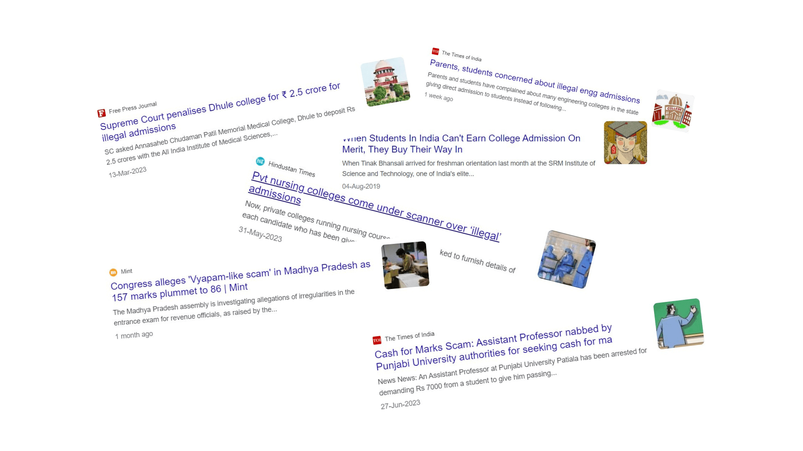
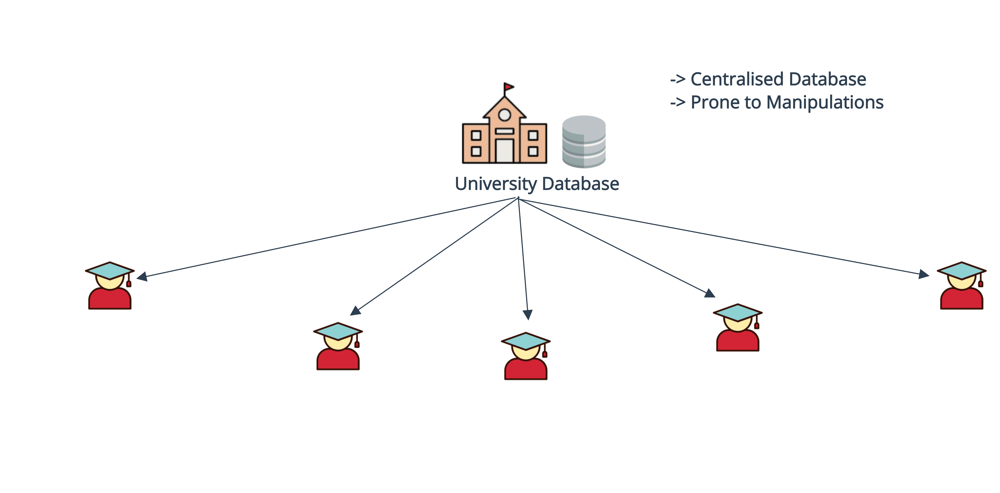

## The Problem
In the realm of higher education, the reliance on centralized databases for student information management has led to a host of challenges. Unauthorized admissions, data manipulation, and compromised record security have become persistent issues, affecting hundreds of educational institutions annually. These vulnerabilities erode trust in admission processes and data accuracy, impacting the educational ecosystem at large. This pressing problem demands a transformative solution to ensure the integrity and security of student data, safeguarding the credibility of academic institutions and the future of students. Drawing from my personal experience as a student at the University of Indore (DAVV), where unauthorized admissions have tarnished the institution's reputation, I was inspired to create a solution that mitigates this problem and establishes a more reliable framework for student data management.

## The Solution

