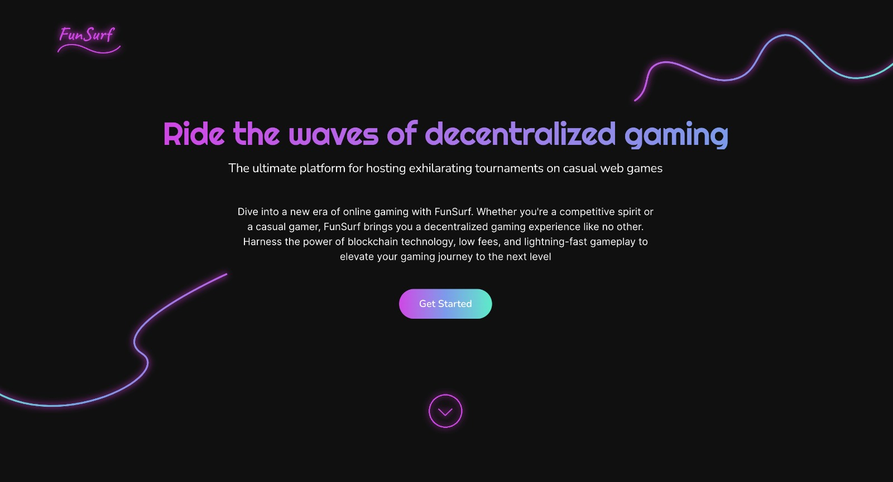
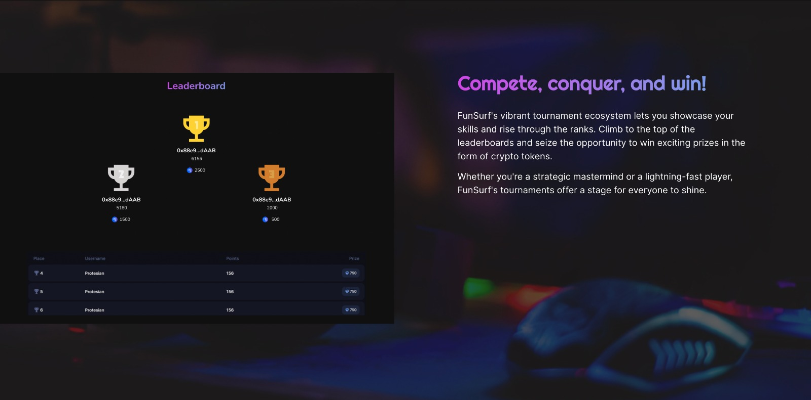
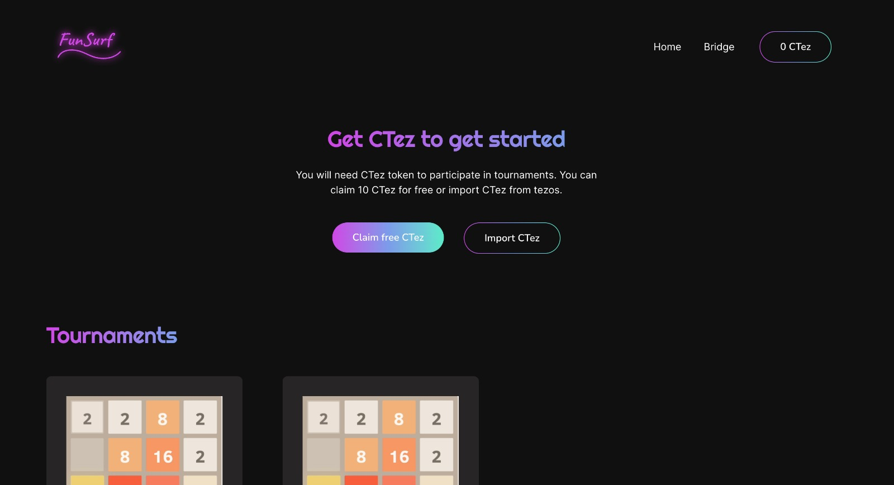
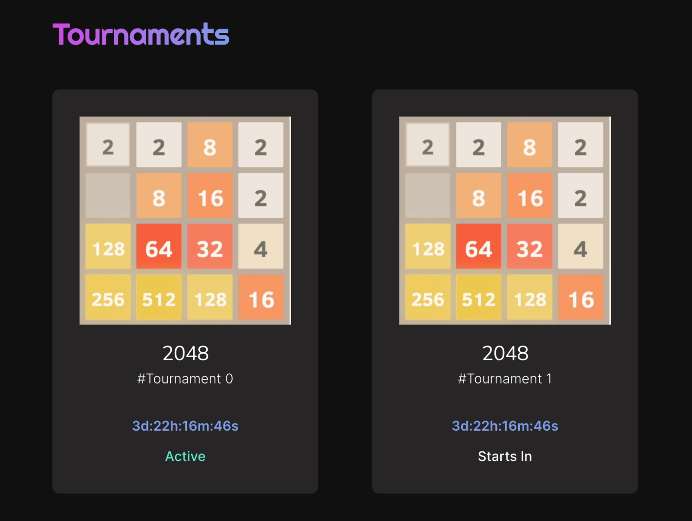
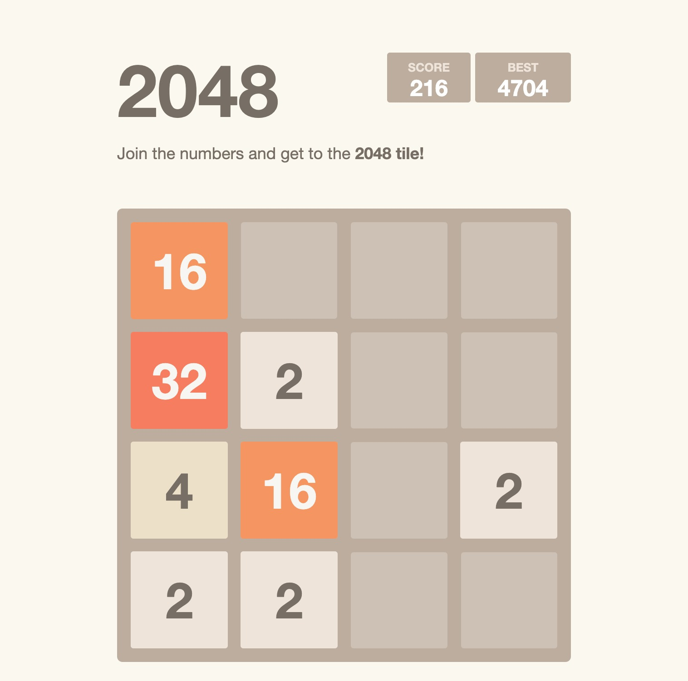
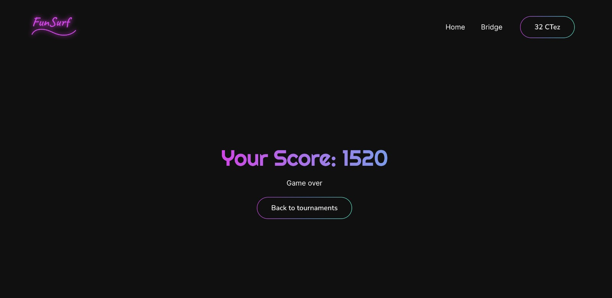
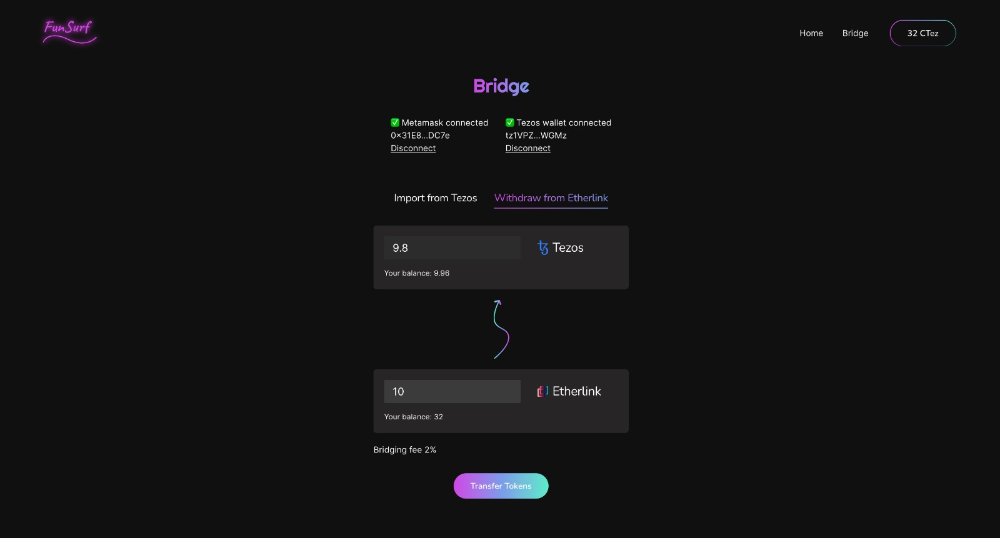

# FunSurf
## By Team Juggernaut

Funsurf is the ultimate platform for hosting exhilarating tournaments on casual web games. FunSurf is your gateway to thrilling decentralized gaming. Join tournaments, compete in casual web games, and climb leaderboards for crypto prizes. With seamless onboarding, and Tezos-Etherlink bridge, experience low fees, speed, and security for an endless gaming!

Check it out at https://funsurf.netlify.app/

## Problem it solves
FunSurf is a revolutionary solution that addresses the key challenges in blockchain gaming.

- **Infinite Scale** - By leveraging cutting-edge rollup technology, FunSurf eliminates the scalability bottleneck, enabling the platform to accommodate millions of players without compromising speed or security.
- **EVM compatibility** - FunSurf uses Etherlink rollup on Tezos blockchian that provides EVM compatibility. Due to this, the onboarding process for Ethereum users is effortless, providing a familiar environment for gamers to dive into.
- **Tezos bridge** - The built-in bridge seamlessly integrates Etherlink rollup with Tezos, allowing for instant token transfers and gameplay, bypassing the usual delays.

FunSurf is the ultimate fusion of innovation, accessibility, and integration, making decentralized gaming more inclusive and exciting than ever before.

## Tech Stacks
### Smart Contracts
- Smartpy for Tezos contracts
- Solidity and Hardhat for EVM (Etherlink) contracts

### Frontend
- React
- Typescript
- Tailwind CSS
- Jotai for state management
- Beacon SDK for Tezos wallet integration
- Taquito for Tezos contract interaction
- Wagmi & Viem for Etherlink integration

### Backend
- NodeJS
- Express
- Taquito for Tezos integration
- Viem for Etherlink integration

## Deployed links
### Smart contracts links
#### Smartpy contracts
- Treasury: `KT1PW3ntfDkFuyZkPJ3P41F95g7f2frKx6Pf`
- CTez token: `KT1Q4ecagDAmqiY3ajvtwfNZyChWy86W7pzb`

#### Solidity contracts
- Bridge: `0x2CC1E8428177926Fe48EA8Ae162f3C9563a293E9`
- Tournament: `0x368688e8D456809408af67FE74B327B24bcbeC8a`

### Live project link
https://funsurf.netlify.app/

### Github repo link
https://github.com/shwetalsoni/TezAsia-2k23/tree/main/Juggernaut

## PPT
https://docs.google.com/presentation/d/15f8BURqBr4KX4LtI-3O59y78-CJMhbeWGCU-CTbtAmA/edit?usp=sharing

## Video Demo
https://youtu.be/I-YHthgsDSw

## Team Members
- Anshit
- Shwetal Soni

## Demo

